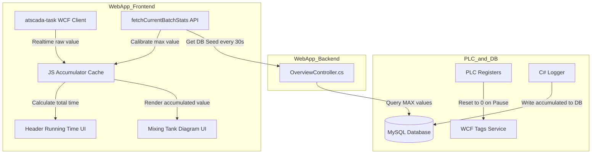
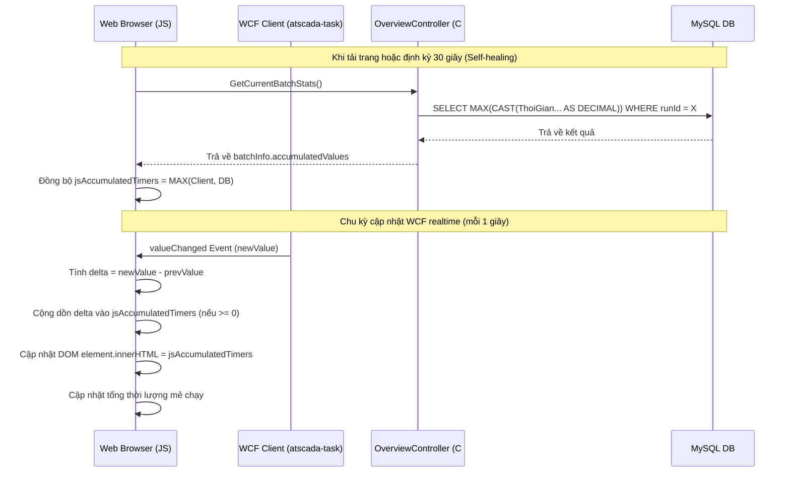

# Technical Design Document - WebApp Accumulate Stage Duration

---
**Purpose**: Hướng dẫn chi tiết thiết kế hệ thống hiển thị tích lũy thời gian công đoạn thực tế realtime trên WebApp (Overview Dashboard và Header), đảm bảo thống nhất khi triển khai và không bị trôi số thời gian.
---

## Overview

### Purpose
Tính năng này cung cấp giải pháp hiển thị thời gian công đoạn tích lũy chính xác theo thời gian thực tế trên giao diện WebApp (bao gồm Sơ đồ bồn trộn và Header tổng thời gian mẻ chạy). Giải pháp này khắc phục sự cố sụt giảm/reset thời gian hiển thị về 0 giây mỗi khi máy ở trạng thái tạm dừng (Pause) do PLC reset thanh ghi.

### Users
- **Nhà vận hành hệ thống (Operators):** Theo dõi chính xác tiến độ của từng công đoạn và tổng thời gian chạy thực tế của mẻ sản xuất trên màn hình điều khiển.
- **Quản lý nhà máy (Managers):** Xem báo cáo năng suất và thời gian thực hiện mẻ chạy chính xác mà không bị sai lệch số liệu.

### Impact
- Thay đổi logic truy vấn của API Backend `GetCurrentBatchStats` để trả về thêm các trường thời gian tích lũy lớn nhất từ database.
- Thay đổi cơ chế hiển thị trên giao diện của WebApp để chuyển từ hiển thị trực tiếp tag PLC sang hiển thị bộ tích lũy Client-side JS được hiệu chuẩn từ DB.

### Goals
- **G1 (Realtime Accuracy):** Hiển thị đúng thời gian tích lũy thực tế của từng công đoạn và tổng thời gian mẻ chạy mà không bị reset về 0 khi tạm dừng.
- **G2 (Self-healing Consistency):** Đảm bảo đồng bộ hóa chính xác số liệu tích lũy giữa Client và DB MySQL ngay cả khi người dùng F5 tải lại trang.
- **G3 (Zero Lag Performance):** Quá trình cập nhật realtime 1s trên giao diện không làm tăng tải của database MySQL (sử dụng cơ chế hybrid polling 30s).
- **G4 (Header Clock Protection):** Khóa ticking clock của Header WebApp khi máy đang ở trạng thái Tạm dừng (`isPaused === 1`).

### Non-Goals
- Không thay đổi thiết kế cơ sở dữ liệu hiện tại của bảng `alarmreport` và `runs`.
- Không can thiệp hoặc thay đổi chương trình PLC của máy trộn.
- Không thay đổi cơ chế tích lũy ở phần Logger C# (đã được hoàn thành ở phase trước).

---

## Architecture

### Existing Architecture Analysis
Hiện tại, WebApp đang cập nhật giá trị thời gian công đoạn thông qua 2 cơ chế độc lập:
1. **Real-time Tags (WCF):** WebApp Client lắng nghe sự thay đổi giá trị của các tag thời gian (ví dụ: `ThoiGianCapLieu`, `ThoiGianTron1`...) trực tiếp từ WCF client thông qua thư viện `atscada-task`. Khi nhận được giá trị mới, Client sẽ ghi đè trực tiếp giá trị thô này vào thuộc tính `innerHTML` của các thẻ UI.
2. **Periodic Polling (30s):** Định kỳ 30 giây, hàm `fetchCurrentBatchStats` sẽ gọi về Backend (`/Overview/GetCurrentBatchStats`) để lấy trạng thái tổng quát của mẻ chạy, danh sách các công đoạn đã hoàn thành và cấu hình thời gian chuẩn.

Khi máy tạm dừng, PLC reset tag thời gian về 0, WCF gửi tín hiệu 0 làm UI lập tức hiển thị 0 giây.

### Architecture Pattern & Boundary Map
Giải pháp thiết kế sử dụng mô hình **Hybrid Client-Server Accumulator** như sau:



### Technology Stack

| Layer | Choice / Version | Role in Feature | Notes |
|-------|------------------|-----------------|-------|
| Frontend / UI | HTML5 / JavaScript (ES5/ES6) | Quản lý bộ đếm JS và render UI | Kế thừa từ frontend WebApp hiện tại |
| Backend / Services | ASP.NET MVC (.NET Framework 4.7.2) | Cung cấp dữ liệu tích lũy từ database | File `OverviewController.cs` |
| Data / Storage | MySQL 8.0 | Lưu trữ lịch sử mẻ chạy và telemetry | Bảng `alarmreport` |

---

## System Flows

### 1. Đồng bộ ban đầu và Realtime Ticking
Luồng hoạt động khi Client nhận được giá trị tag realtime từ WCF hoặc dữ liệu hạt giống từ DB:



---

## Requirements Traceability

| Requirement | Summary | Components | Interfaces | Flows |
|-------------|---------|------------|------------|-------|
| 1.1 | Backend query accumulated values from DB | `OverviewController` | `GetCurrentBatchStats` | Bước 1 trong Sequence |
| 1.2 | Fail-safe return 0 for invalid runId | `OverviewController` | `GetCurrentBatchStats` | Logic Backend |
| 1.3 | Return JSON payload format | `OverviewController` | `GetCurrentBatchStats` | JSON Payload |
| 2.1 | Calculate tag delta on change | `OverviewRealtime.js` | `getJsAccumulatedValue` | Bước 2 trong Sequence |
| 2.2 | Add delta to accumulated timer | `OverviewRealtime.js` | `getJsAccumulatedValue` | Logic JS |
| 2.3 | Handle tag reset (currentVal < prevVal) | `OverviewRealtime.js` | `getJsAccumulatedValue` | Logic JS |
| 2.4 | Update Tank Diagram UI elements | `OverviewRealtime.js` | `updateTimerTag` | UI Rendering |
| 3.1 | Sync Client and DB (Self-healing) | `OverviewRealtime.js` | `fetchCurrentBatchStats` | Bước 1 trong Sequence |
| 3.2 | Reset accumulators on runId change | `OverviewRealtime.js` | `resetJsAccumulators` | Lifecycle Control |
| 3.3 | Display step duration if run not Active | `OverviewRealtime.js` | `updateStepStatsUI` | Logic JS |
| 4.1 | Freeze header running time when paused | `LayoutMain.js` | Ticker Interval (1s) | Ticker Control |
| 4.2 | Resume header running time after pause | `LayoutMain.js` | Ticker Interval (1s) | Ticker Control |

---

## Components and Interfaces

### Backend Controller

#### OverviewController

| Field | Detail |
|-------|--------|
| Intent | Trích xuất thông tin mẻ và truyền dữ liệu thời gian tích lũy lớn nhất từ DB về Client |
| Requirements | 1.1, 1.2, 1.3 |

**Responsibilities & Constraints**
- Kết nối tới DB `scada`, thực hiện query an toàn giá trị MAX của 8 trường thời gian cho `resolvedRunId` đang hoạt động.
- Không để xảy ra lỗi chia cho không hoặc ngoại lệ kiểu dữ liệu khi DB trống.

**Contracts**: API [x] / State [ ]

##### API Contract
`[GET] /Overview/GetCurrentBatchStats`

Response Payload JSON structure (đoạn bổ sung vào `batchInfo`):
```json
{
  "batchInfo": {
    "runId": 123,
    "isPaused": 1,
    "machineStatus": "RUNNING",
    "accumulatedValues": {
      "ThoiGianCapLieu": 105.5,
      "ThoiGianTron1": 60.0,
      "ThoiGianXaDay": 0.0,
      "ThoiGianRungXaDay": 0.0,
      "ThoiGianHutXaDay": 0.0,
      "ThoiGianTron2": 0.0,
      "ThoiGianXaHang": 0.0,
      "ThoiGianRungXaHang": 0.0
    }
  }
}
```

### Frontend Layout

#### LayoutMain.js

| Field | Detail |
|-------|--------|
| Intent | Quản lý đếm giờ Header và theo dõi trạng thái tạm dừng của hệ thống |
| Requirements | 4.1, 4.2 |

**Contracts**: State [x] / Service [ ]

##### State Management
- `window.headerIsPaused`: Biến boolean toàn cục biểu diễn trạng thái pause (`batchInfo.isPaused === 1`).
- `headerMachineStatus`: Biến lưu trạng thái máy (`RUNNING`, `COMPLETED`, `PENDING`).

##### Ticker Ticking Logic
```javascript
// Thay đổi trong LayoutMain.js: Thêm điều kiện !window.headerIsPaused
setInterval(function() {
    const isOverviewPage = document.getElementById('dailyBatchesBody') !== null;
    if (!isOverviewPage && headerMachineStatus === "RUNNING" && !window.headerIsPaused) {
        const runningTimeEl = document.getElementById("headerRunningTime");
        if (runningTimeEl && lastHeaderUpdateLocalTime > 0) {
            const elapsedSinceUpdate = Math.floor((Date.now() - lastHeaderUpdateLocalTime) / 1000);
            const currentRunningSeconds = Math.floor(headerRunningSeconds + elapsedSinceUpdate);
            runningTimeEl.innerHTML = currentRunningSeconds + "s";
        }
    }
}, 1000);
```

### Frontend Realtime

#### OverviewRealtime.js

| Field | Detail |
|-------|--------|
| Intent | Thực hiện tích lũy thời gian thực client-side và đồng bộ hóa UI bồn trộn |
| Requirements | 2.1, 2.2, 2.3, 2.4, 3.1, 3.2, 3.3 |

**Contracts**: State [x] / Service [x]

##### State Management
```typescript
interface AccumulatorState {
  jsAccumulatedTimers: Record<number, number>; // key: stageCode (1-8), value: seconds
  jsPreviousTimerValues: Record<number, number | null>; // key: stageCode (1-8), value: raw plc value
}
```

##### Client-side Logic (Interfaces)
```typescript
interface JSAccumulatorHelper {
  getJsAccumulatedValue(stageCode: number, alias: string, currentVal: number): number;
  resetJsAccumulators(): void;
  updateTimerTag(dataTag: any, element: HTMLElement, stageCode: number, alias: string): void;
}
```

##### Implementation Notes
- Sử dụng hàm `updateTimerTag` thay cho hàm `updateTag` cũ đối với 8 thẻ chứa giá trị thời gian công đoạn trên Sơ đồ bồn trộn.
- Tại callback `success` của `fetchCurrentBatchStats` API:
  - Nếu `data.batchInfo.runId` khác với `activeRunId` hiện tại $\rightarrow$ gọi `resetJsAccumulators()`.
  - Cập nhật `jsAccumulatedTimers[code] = Math.max(jsAccumulatedTimers[code], dbVal)`.

---

## Data Models

### Domain & Logical Model
*Không có sự thay đổi nào đối với cấu trúc dữ liệu của database.*
Trạng thái tích lũy được lưu trực tiếp trong các cột hiện hữu của bảng `alarmreport` do Logger C# đẩy lên. Do đó, tầng WebApp chỉ có nhiệm vụ **đọc** (Read-only) và quản lý bộ nhớ tạm thời trên Client (Client Memory State).

---

## Error Handling

### Error Strategy
- **Mất kết nối WCF (Real-time Tags):** Nếu kết nối WCF bị đứt, giá trị tag không đổi, bộ tích lũy Client sẽ đứng yên. Khi kết nối lại, giá trị tag mới sẽ được xử lý.
  - Nếu tag nhảy vọt từ giá trị cũ lên giá trị mới $\rightarrow$ delta tăng bình thường.
  - Nếu tag bị reset về 0 trong lúc mất mạng $\rightarrow$ bộ tích lũy client giữ nguyên giá trị tích lũy cũ.
- **Lỗi gọi API Backend (Polling 30s):** Nếu API polling thất bại (mạng lỗi, server lỗi) $\rightarrow$ Client sẽ ghi log lỗi vào console và duy trì chạy tiếp bằng bộ tích lũy in-memory mà không làm đứng giao diện hay crash trang Web.

---

## Testing Strategy

### Unit Tests (Backend C#)
1. `Test_GetCurrentBatchStats_ActiveRun_Returns_AccumulatedValues`: Kiểm tra khi có Run đang Active, API trả về đầy đủ object `accumulatedValues` với giá trị lớn nhất từ DB.
2. `Test_GetCurrentBatchStats_InvalidRun_Returns_ZeroValues`: Kiểm tra khi `runId` là `-1` hoặc `null`, API trả về object `accumulatedValues` chứa toàn bộ giá trị 0.
3. `Test_GetCurrentBatchStats_EmptyTable_Returns_Zero`: Kiểm tra khi bảng `alarmreport` trống, API trả về 0 cho tất cả 8 công đoạn.

### Unit Tests (Frontend JS)
4. `Test_getJsAccumulatedValue_IncreasingTag_IncrementsAccumulator`: Kiểm tra khi tag tăng dần (1.5 $\rightarrow$ 2.5), bộ tích lũy tăng chính xác (được cộng thêm 1.0s).
5. `Test_getJsAccumulatedValue_ResetTag_HoldsAccumulatedValue`: Kiểm tra khi tag reset về 0 (5.0 $\rightarrow$ 0), bộ tích lũy giữ nguyên giá trị tích lũy (5.0s) mà không bị sụt giảm.
6. `Test_getJsAccumulatedValue_ResumeTag_AccumulatesFromPrevious`: Kiểm tra khi tag tăng lại sau reset (0 $\rightarrow$ 1.5), bộ tích lũy tăng tiếp từ mốc cũ (5.0s + 1.5s = 6.5s).

### Integration & E2E Tests
7. **Kịch bản Đồng bộ F5 (Page Refresh):**
   - Thiết lập DB có mốc công đoạn 1 đã tích lũy 120s.
   - Tải lại trang WebApp Overview.
   - Kết quả mong muốn: Ô `#feedingTime` hiển thị ngay lập tức 120 giây (không hiển thị 0 giây).
8. **Kịch bản Tạm dừng (Pause):**
   - Đang chạy công đoạn 2, giá trị tag tăng lên 45s.
   - Gán `STOP = 1` và tag công đoạn 2 reset về 0.
   - Kết quả mong muốn: Giao diện bồn trộn hiển thị đứng im ở 45s, Header và đếm tổng thời lượng mẻ chạy dừng lại, không tăng tiếp.
9. **Kịch bản Chuyển mẻ mới:**
   - Hoàn thành mẻ chạy cũ (`runId` = 100), chuyển sang mẻ chạy mới (`runId` = 101).
   - Kết quả mong muốn: Giao diện bồn trộn reset tất cả các giá trị thời gian công đoạn về 0s.
