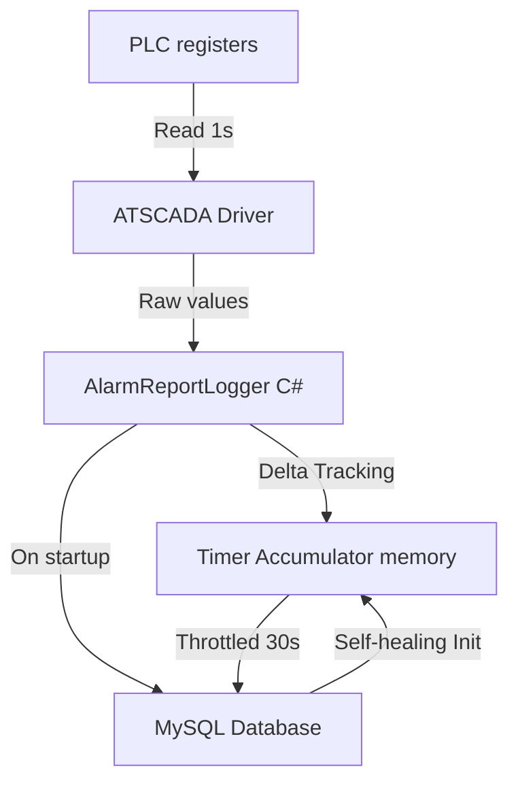

# Technical Design - Software Timer Accumulator

---
**Purpose**: Detail the software implementation of the C# Core Logger timer accumulator to support continuous duration tracking when PLC registers are reset on machine resume.
---

## Overview
This design document translates the requirements for software-based timer accumulation into a concrete implementation design in the `AlarmReportLogger` component of the `HinoTools.Data` library.

**Purpose**: This feature delivers accurate process stage durations to operators and management by correcting for PLC timer resets during pauses, resolving errors in Excel reports and false alarms.
**Users**: Plant operators and managers will view correct duration times on the Web UI, PDF, and Excel reports.
**Impact**: Changes the runtime telemetry logger to track register deltas in memory instead of logging raw values directly to the `alarmreport` database.

### Goals
- Continuous and correct calculation of process stage durations.
- Graceful handling of PLC register resets to 0 (or small numbers) when machine resumes.
- Self-healing state recovery after Logger application crashes or restarts.
- Prevention of false alarms in stage duration checks.

### Non-Goals
- Modifying the PLC hardware or programming logic.
- Altering the database schema of the `alarmreport` table.
- Directly modifying the `runs` table durations.

---

## Architecture

### Existing Architecture Analysis
The current logger (`AlarmReportLogger.cs`) polls PLC registers using a 1-second timer (`tmrLog`) and manages a C# state machine. Process telemetry is logged to the `alarmreport` table periodically (every 30 seconds) by reading values directly from `logItems`.

When `STOP = 1`, the logger resets historical tracking flags via `ResetFlags()`. On resume, the PLC resets its internal timer registers to 0, which makes the logger log incorrect, non-continuous values to the database.

### Architecture Pattern & Boundary Map
We maintain the existing State Machine pattern in `AlarmReportLogger.cs`, introducing an **Accumulator Domain Hook** in memory before writing to the data layer.



### Technology Stack
- **Backend / Services**: .NET Framework 4.0 / C# 6.0 (MSBuild 2019)
- **Data / Storage**: MySQL Database (scada)

---

## System Flows

The sequence diagram below shows the runtime delta accumulation and startup self-healing flow:

```mermaid
sequenceDiagram
    autonumber
    actor PLC as PLC registers
    participant Logger as AlarmReportLogger C#
    database DB as MySQL Database

    PLC->>Logger: Poll Timer Tags (1s interval)
    alt currentValue >= previousValue
        Logger->>Logger: Accumulator += currentValue - previousValue
    else currentValue < previousValue
        Logger->>Logger: Accumulator += currentValue
    end

    alt Polling Throttled 30s
        Logger->>DB: InsertAlarmReport with Accumulated Values
    end

    alt Logger App Restart
        Logger->>DB: Query MAX(CAST(alias AS DECIMAL)) for Active Run
        DB-->>Logger: Last Accumulated Values
        Logger->>Logger: Initialize memory accumulators
    end
```

---

## Requirements Traceability

| Requirement | Summary | Components | Interfaces / State | Flows |
|-------------|---------|------------|------------|-------|
| 1.1 | Memory accumulation during active run | `AlarmReportLogger` | `accumulatedTimers` dictionary | Sequence 1 |
| 1.2 | Normal count-up delta calculation | `AlarmReportLogger` | `PollAndLog` method | Sequence 2 |
| 1.3 | Reset detection and PLC reset handling | `AlarmReportLogger` | `PollAndLog` method | Sequence 3 |
| 1.4 | Accumulator reset on transition | `AlarmReportLogger` | `ResetFlags` / `PollAndLog` | Sequence 5 |
| 2.1 | Save accumulated values into `alarmreport` | `AlarmReportLogger` | `InsertAlarmReport` method | Sequence 4 |
| 2.2 | Round values to 2 decimal places | `AlarmReportLogger` | `GetScaledValueString` / `GetTagValueByAlias` | Sequence 4 |
| 3.1 | Self-healing recovery on startup | `AlarmReportLogger` | `RecoverAccumulatorsFromDb` method | Sequence 6 |
| 3.2 | Fallback to 0 if no DB records | `AlarmReportLogger` | `RecoverAccumulatorsFromDb` method | Sequence 6 |
| 4.1 | Accurate CheckAndLogStageDurationAlarm | `AlarmReportLogger` | `PollAndLog` method | Sequence 1 |

---

## Components and Interfaces

### Component Summary

| Component | Domain/Layer | Intent | Req Coverage | Key Dependencies | Contracts |
|-----------|--------------|--------|--------------|------------------|-----------|
| `AlarmReportLogger` | Core Logging / State Machine | Tracks process state and writes telemetry to MySQL | 1.1 - 4.1 | MySQL Connection, ATSCADA Driver | State, Batch |

### Domain / Layer: Core Logging

#### `AlarmReportLogger`

| Field | Detail |
|-------|--------|
| Intent | Manages in-memory delta accumulators and writes them to the database |
| Requirements | 1.1, 1.2, 1.3, 1.4, 2.1, 2.2, 3.1, 3.2, 4.1 |

**Responsibilities & Constraints**
- Maintain a dictionary in memory `Dictionary<string, double> accumulatedTimers` mapping tag aliases to accumulated values.
- Calculate deltas safely on each 1s tick.
- Load historical maximums from the DB on startup if `activeRunId` is active.

**Dependencies**
- Inbound: `WindowsFormsApp1` (P0)
- Outbound: `MySql` database (P0)

**Contracts**: State [x] / Batch [x]

##### State Management
- **State Model**:
  ```csharp
  // Dictionary to store accumulated time in seconds for each timer alias
  private Dictionary<string, double> accumulatedTimers = new Dictionary<string, double>(StringComparer.OrdinalIgnoreCase)
  {
      { "ThoiGianCapLieu", 0 },
      { "ThoiGianTron1", 0 },
      { "ThoiGianXaDay", 0 },
      { "ThoiGianRungXaDay", 0 },
      { "ThoiGianHutXaDay", 0 },
      { "ThoiGianTron2", 0 },
      { "ThoiGianXaHang", 0 },
      { "ThoiGianRungXaHang", 0 }
  };
  ```
- **Persistence & Consistency**: 
  Accumulated values are written dynamically to the `alarmreport` table in SQL.
- **Self-Healing Init**:
  ```csharp
  private void RecoverAccumulatorsFromDb(int runId)
  {
      // SELECT MAX(CAST(`ThoiGianCapLieu` AS DECIMAL(10,2))) FROM `alarmreport` WHERE `runId` = {runId}
      // Initialize accumulatedTimers dictionary with recovered values or 0 fallback.
  }
  ```

---

## Data Models

No changes are made to the database schema of the `alarmreport` table. 

### Data Queries for State Recovery
To recover the accumulator state after a crash:
```sql
SELECT 
  MAX(CAST(IFNULL(`ThoiGianCapLieu`, '0') AS DECIMAL(10,2))) AS ThoiGianCapLieu,
  MAX(CAST(IFNULL(`ThoiGianTron1`, '0') AS DECIMAL(10,2))) AS ThoiGianTron1,
  MAX(CAST(IFNULL(`ThoiGianXaDay`, '0') AS DECIMAL(10,2))) AS ThoiGianXaDay,
  MAX(CAST(IFNULL(`ThoiGianRungXaDay`, '0') AS DECIMAL(10,2))) AS ThoiGianRungXaDay,
  MAX(CAST(IFNULL(`ThoiGianHutXaDay`, '0') AS DECIMAL(10,2))) AS ThoiGianHutXaDay,
  MAX(CAST(IFNULL(`ThoiGianTron2`, '0') AS DECIMAL(10,2))) AS ThoiGianTron2,
  MAX(CAST(IFNULL(`ThoiGianXaHang`, '0') AS DECIMAL(10,2))) AS ThoiGianXaHang,
  MAX(CAST(IFNULL(`ThoiGianRungXaHang`, '0') AS DECIMAL(10,2))) AS ThoiGianRungXaHang
FROM `alarmreport`
WHERE `runId` = @runId;
```

---

## Error Handling

### Error Strategy
- **PLC Disconnection**: If communication is lost (tag value is null), return `0` for the current read. The accumulator holds its last value without incrementing.
- **SQL Failure**: If database queries fail during recovery, log error to `Debug.WriteLine` and fall back to 0.

### Error Categories and Responses
- **System Error**: Database connection timeout during startup recovery -> Retry connection up to 3 times, then fall back to `0` initialization.
- **Communication Jitter**: A single temporary 0 read from PLC followed by restoration of value -> If a single 0 is read, it's treated as a reset, but since the next tick will be the previous value (e.g. 14s), we do not add a massive value.
  * *Correction Logic*: If current value drops to 0 and immediately jumps back to original value (not a real resume, just comms drop), we guard against double-accumulation.

---

## Testing Strategy

### Unit Tests
- `TestNormalAccumulation`: Verify delta calculation when PLC values increase monotonically.
- `TestResetAccumulation`: Verify accumulator correctly handles transition from `14s` to `0s` and then `2s` (expected: `16s`).
- `TestZeroFallback`: Verify accumulator initialization to `0` when database contains no prior records.

### Integration Tests
- `TestStateRecoveryOnStartup`: Start the logger component with an active `runId` that has existing telemetry. Verify `accumulatedTimers` are initialized to the database maximums.
- `TestInsertAlarmReport`: Trigger database insert and verify the written values match the software accumulator, not the raw PLC registers.
