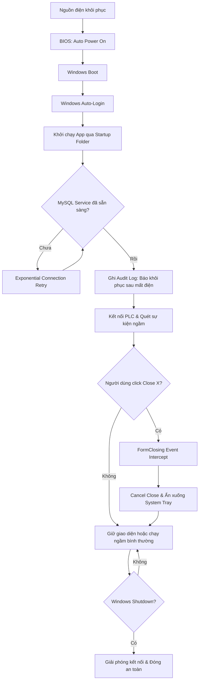

# Báo cáo Phân tích Chuyên sâu: Giải pháp Chống lỗi (Fault Tolerance) & Tự phục hồi trong Môi trường Xí nghiệp
## Dự án: HinoTools.Alarm (.NET Framework 4.5 & MySQL)

Tài liệu này phân tích các kịch bản sự cố vật lý, hạ tầng phần cứng và mạng thực tế trong môi trường xí nghiệp/nhà máy đối với phần mềm giám sát cảnh báo **HinoTools.Alarm**, đồng thời đề xuất giải pháp kỹ thuật cụ thể bằng mã nguồn C# và cấu hình Windows/MySQL dựa trên phản hồi thực tế từ kỹ sư vận hành.

---

## 📌 Bối cảnh và Ràng buộc hệ thống
Dựa trên các trao đổi và xác thực thực tế từ dự án:
1.  **Công nghệ core:** Ứng dụng Desktop chạy trên **C# .NET Framework 4.5**, cơ sở dữ liệu chính là **MySQL**.
2.  **Đã sử dụng InnoDB:** Hệ thống hiện tại **đang chạy mặc định trên Storage Engine InnoDB** (không sử dụng MyISAM). Đây là điểm cộng lớn về an toàn dữ liệu.
3.  **Không có bộ lưu điện (No UPS):** Khi mất điện đột ngột, toàn bộ máy tính chạy phần mềm và thiết bị (PLC, Gateway) sẽ tắt nguồn ngay lập tức. Hệ thống không lưu dữ liệu trong khoảng thời gian sập nguồn này.
4.  **Yêu cầu vận hành luôn chạy ngầm (Uptime 24/7):** Phần mềm và MySQL phải luôn ở trạng thái sẵn sàng. Ngay cả khi người vận hành **lỡ tay bấm nút Close (X) hoặc tắt giao diện**, ứng dụng vẫn phải tiếp tục chạy ngầm trong System Tray chứ không được tắt hẳn. Ứng dụng chỉ được phép đóng khi Windows shutdown hoặc có sự can thiệp của Quản trị viên (Admin).

---

## 🛠️ Danh sách các kịch bản sự cố thực tế & Giải pháp khắc phục



---

### KỊCH BẢN 1: Tự khởi động và Khôi phục kết nối khi có điện lại (Auto-Start & Boot Recovery)
**Vấn đề:** Khi có điện lại, hệ thống cần tự khởi động 100% mà không cần nhân viên vận hành đến bấm nút nguồn máy tính, đăng nhập Windows và click mở app. 
*   **Thiết lập phần cứng (BIOS):** Bật tính năng **AC Power Loss Recovery** (hoặc *Restore on AC Power Loss*) thành **Power On**. Khi dòng điện cấp lại, máy tính sẽ tự động bật nguồn.
*   **Giải pháp Phần mềm (C# Reconnection Loop):** Khi Windows vừa khởi động, ứng dụng có thể chạy trước khi dịch vụ MySQL (MySQL Service) hoặc driver mạng sẵn sàng. Ta triển khai vòng lặp kết nối an toàn với cơ chế **Exponential Backoff** (thời gian chờ tăng dần) tại điểm khởi chạy ứng dụng (ví dụ: `Program.cs` hoặc sự kiện `Load` của Form chính).

```csharp
// Cơ chế tự động kết nối lại MySQL với thời gian chờ tăng dần tại startup
public static class DatabaseInitializer
{
    private static readonly string ConnectionString = "Server=localhost;Uid=root;Pwd=101101;";

    public static bool WaitForDatabaseReady(int maxRetries = 10, int initialDelayMs = 2000)
    {
        int delay = initialDelayMs;
        for (int i = 1; i <= maxRetries; i++)
        {
            try
            {
                using (var conn = new MySql.Data.MySqlClient.MySqlConnection(ConnectionString))
                {
                    conn.Open();
                    return true; // Kết nối thành công, MySQL đã sẵn sàng
                }
            }
            catch (MySql.Data.MySqlClient.MySqlException)
            {
                if (i == maxRetries) return false;
                System.Threading.Thread.Sleep(delay);
                delay *= 2; // Tăng gấp đôi thời gian chờ (2s -> 4s -> 8s -> 16s...)
            }
        }
        return false;
    }
}
```

*   **Đánh dấu mốc sự cố (Audit Log):** Ngay sau khi kết nối MySQL thành công ở lần khởi động đầu tiên, hệ thống ghi 1 dòng log hệ thống đặc biệt vào bảng `realtime_alarms` để đánh dấu thời điểm hệ thống bắt đầu chạy lại sau sập nguồn:
    ```sql
    INSERT INTO `realtime_alarms` (`DateTime`, `CongDoan`, `Severity`, `EventMessage`) 
    VALUES (NOW(), 'SYSTEM', 'INFO', 'Hệ thống tự động khôi phục hoạt động sau sự cố mất điện đột ngột.');
    ```

---

### KỊCH BẢN 2: Bảo vệ tính toàn vẹn dữ liệu MySQL (MySQL Engine & Transaction Safety)
Do hệ thống **đang chạy trên công cụ InnoDB** (không phải MyISAM), cấu trúc bảng đã có khả năng tự phục hồi (Crash Recovery) thông qua cơ chế Write-Ahead Logging (`ib_logfile`). Để tối ưu hóa an toàn sập nguồn, chúng ta thực hiện cấu hình các tham số MySQL server và dùng Transaction trong C#.

#### 2.1. Cấu hình Cơ sở dữ liệu tối ưu (`my.ini`):
```ini
[mysqld]
# Ghi log transaction xuống đĩa cứng sau mỗi lần COMMIT (An toàn sập nguồn tuyệt đối)
innodb_flush_log_at_trx_commit = 1

# Đồng bộ nhị phân log xuống đĩa cứng ngay sau khi ghi
sync_binlog = 1
```

#### 2.2. Giải pháp phần mềm (C# Transaction):
Khi thực hiện các thao tác ghi dữ liệu nhiều bước liên tiếp (Ví dụ: Thêm mẻ mới vào `alarmreport` đồng thời ghi sự kiện `INFO` vào `realtime_alarms`), bắt buộc sử dụng **Transaction** để tránh tình trạng dữ liệu mẻ có nhưng log công đoạn bị thiếu.

```csharp
public bool SaveBatchStateWithTransaction(string queryReport, string queryAlarm)
{
    using (var conn = new MySqlConnection(ConnectionString))
    {
        conn.Open();
        using (var transaction = conn.BeginTransaction())
        {
            try
            {
                using (var cmd = new MySqlCommand(queryReport, conn, transaction))
                {
                    cmd.ExecuteNonQuery();
                }
                using (var cmd = new MySqlCommand(queryAlarm, conn, transaction))
                {
                    cmd.ExecuteNonQuery();
                }
                transaction.Commit(); // Ghi nhận an toàn cả 2 bảng
                return true;
            }
            catch (Exception ex)
            {
                transaction.Rollback(); // Hủy bỏ nếu có 1 bước lỗi để tránh lệch pha dữ liệu
                LocalCrashLogger.WriteLog($"Lỗi Transaction: {ex.Message}. Đã rollback.");
                return false;
            }
        }
    }
}
```

---

### KỊCH BẢN 3: Vận hành luôn chạy ngầm & Chống tắt nhầm (Accidental Close Protection)
**Vấn đề:** Trong nhà máy, người vận hành (operators) có thể lỡ tay tắt ứng dụng bằng cách nhấn dấu `X` ở góc màn hình hoặc nhấn `Alt + F4`. Việc này sẽ tắt WCF Host bên trong ứng dụng, làm đứt toàn bộ kết nối Client-Server và dừng ghi log.
**Giải pháp:** 
1.  Bắt sự kiện đóng Form để chặn hành vi tắt ứng dụng. 
2.  Ẩn ứng dụng xuống dưới khay hệ thống (**Windows System Tray**) để ứng dụng tiếp tục chạy ngầm.
3.  Chỉ cho phép tắt hẳn ứng dụng khi Windows tắt hoặc quản trị viên thoát thông qua Menu khay hệ thống (có thể kèm mật khẩu xác nhận).

#### 3.1. Code C# chặn sự kiện tắt ứng dụng (`Form1.cs`):
```csharp
public partial class Form1 : Form
{
    private NotifyIcon sysTrayIcon;
    private ContextMenuStrip trayMenu;
    private bool isExplicitClose = false; // Flag kiểm tra thoát ứng dụng chủ động từ Admin

    public Form1()
    {
        InitializeComponent();
        InitializeSystemTray();
    }

    private void InitializeSystemTray()
    {
        trayMenu = new ContextMenuStrip();
        trayMenu.Items.Add("Hiển thị giao diện", null, (s, e) => { this.Show(); this.WindowState = FormWindowState.Normal; });
        trayMenu.Items.Add("-");
        trayMenu.Items.Add("Thoát hoàn toàn (Admin)", null, MenuExit_Click);

        sysTrayIcon = new NotifyIcon();
        sysTrayIcon.Text = "HinoTools Alarm Service - Đang hoạt động ngầm";
        sysTrayIcon.Icon = SystemIcons.Application; // Thay bằng Icon tùy chỉnh
        sysTrayIcon.ContextMenuStrip = trayMenu;
        sysTrayIcon.Visible = true;

        // Double click vào icon khay hệ thống để mở lại giao diện
        sysTrayIcon.DoubleClick += (s, e) => { this.Show(); this.WindowState = FormWindowState.Normal; };
    }

    // Xử lý sự kiện FormClosing
    protected override void OnFormClosing(FormClosingEventArgs e)
    {
        // Nếu người dùng bấm nút Close (X) hoặc Alt+F4
        if (e.CloseReason == CloseReason.UserClosing && !isExplicitClose)
        {
            e.Cancel = true; // Chặn việc đóng ứng dụng
            this.Hide();     // Ẩn Form đi
            
            // Hiển thị thông báo nhỏ ở khay hệ thống để người vận hành biết
            sysTrayIcon.ShowBalloonTip(3000, 
                "Hệ thống đang chạy ngầm", 
                "Ứng dụng HinoTools.Alarm vẫn đang tiếp tục thu thập dữ liệu cảnh báo và chạy ngầm.", 
                ToolTipIcon.Info);
        }
        else
        {
            // Cho phép đóng nếu là do Windows Shutdown hoặc Admin bấm nút thoát
            sysTrayIcon.Visible = false;
            sysTrayIcon.Dispose();
            base.OnFormClosing(e);
        }
    }

    private void MenuExit_Click(object sender, EventArgs e)
    {
        var confirmResult = MessageBox.Show(
            "Bạn có chắc chắn muốn tắt hoàn toàn hệ thống cảnh báo HinoTools? Việc này sẽ dừng thu thập dữ liệu!",
            "Xác nhận thoát",
            MessageBoxButtons.YesNo,
            MessageBoxIcon.Warning);

        if (confirmResult == DialogResult.Yes)
        {
            isExplicitClose = true;
            Application.Exit();
        }
    }
}
```

---

### KỊCH BẢN 4: Chạy ngầm bền bỉ trên hệ điều hành Windows (Persistent Execution & Session 0 Isolation)

> [!CAUTION]
> **CẢNH BÁO QUAN TRỌNG VỀ WINDOWS SERVICE / SYSTEM SCHEDULER:**
> Không đăng ký ứng dụng WinForms chạy dưới quyền tài khoản **`SYSTEM`** hoặc chạy trước khi đăng nhập Windows (Startup Task ở dạng Background Service).
> 
> *Nguyên nhân:* Kể từ Windows Vista, Windows áp dụng cơ chế cô lập **Session 0 Isolation**. Khi một tác vụ chạy dưới quyền `SYSTEM` trước khi đăng nhập, nó sẽ bị cô lập hoàn toàn vào **Session 0** (không có môi trường đồ họa GUI). 
> 
> Hậu quả là các driver công nghiệp kết nối phần cứng (như **`ATDriverService`** đọc PLC, OPC Client, Modbus, các cổng COM serial, v.v.) vốn cần không gian bộ nhớ của User Session (Session 1 trở đi) để truy cập tài nguyên phần cứng, mạng và khóa bản quyền sẽ **bị lỗi không thể khởi động được**.

#### 4.1. Giải pháp tối ưu cho SCADA (Windows Auto-Login & Startup Folder)
Phương án chuẩn công nghiệp và an toàn nhất để khởi động phần mềm SCADA WinForms cùng driver kết nối PLC là cho phép Windows tự động đăng nhập vào tài khoản User vận hành và chạy app trực tiếp trong Session đó.

1.  **Cấu hình Windows Auto-Login:**
    *   Mở PowerShell bằng quyền Administrator.
    *   Chạy tệp script bằng lệnh sau:
       powershell -ExecutionPolicy Bypass -File "C:\Users\tanhv\Project\HinoTools.Alarm_27092023_Test\HinoTools.Alarm_27092023_Test\scratch\setup_autologin.ps1" 
    *   Nhập Username và Mật khẩu theo hướng dẫn trên màn hình. Script sẽ tự động chỉnh sửa Registry an toàn để kích hoạt Auto-Login.
2.  **Khởi động qua thư mục Startup của User (Session 1):**
    *   Nhấn `Win + R` -> gõ `shell:startup` và nhấn Enter. Thư mục khởi chạy của người dùng hiện tại sẽ xuất hiện.
    *   Tạo Shortcut của tệp tin `WindowsFormsApp1.exe` và kéo vào thư mục này.
    *   *Ưu điểm:* Ứng dụng sẽ chạy trong không gian bảo mật đầy đủ của User, có toàn quyền gọi và tải các driver truyền thông phần cứng (như `ATDriverService`) hoạt động chính xác 100%.

---

### KỊCH BẢN 5: Bộ đệm dự phòng khi MySQL Offline đột ngột (Store-and-Forward Caching)
Nếu mạng xưởng bị chập chờn, CSDL MySQL không ghi được dữ liệu, C# sẽ chuyển sang **Local Buffer Mode**, ghi tạm dữ liệu dạng CSV vào đĩa cứng cục bộ. Khi kết nối MySQL online lại, hệ thống sẽ đồng bộ bù dữ liệu đã lưu tạm để tránh mất mát log lịch sử.

```csharp
public static class LocalBufferQueue
{
    private static readonly string BufferFolder = Path.Combine(AppDomain.CurrentDomain.BaseDirectory, "BufferQueue");

    static LocalBufferQueue()
    {
        if (!Directory.Exists(BufferFolder)) Directory.CreateDirectory(BufferFolder);
    }

    public static void PushToBuffer(string tableName, string csvLine)
    {
        try
        {
            string filePath = Path.Combine(BufferFolder, $"{tableName}_buffer.csv");
            lock (BufferFolder)
            {
                using (var sw = new StreamWriter(filePath, true, Encoding.UTF8))
                {
                    // Ghi đè dữ liệu kèm dấu thời gian để flush ngay lập tức xuống ổ đĩa
                    sw.WriteLine($"{DateTime.Now:yyyy-MM-dd HH:mm:ss};{csvLine}");
                }
            }
        }
        catch (Exception ex)
        {
            LocalCrashLogger.WriteLog($"Lỗi ghi bộ đệm cục bộ: {ex.Message}");
        }
    }
}
```
