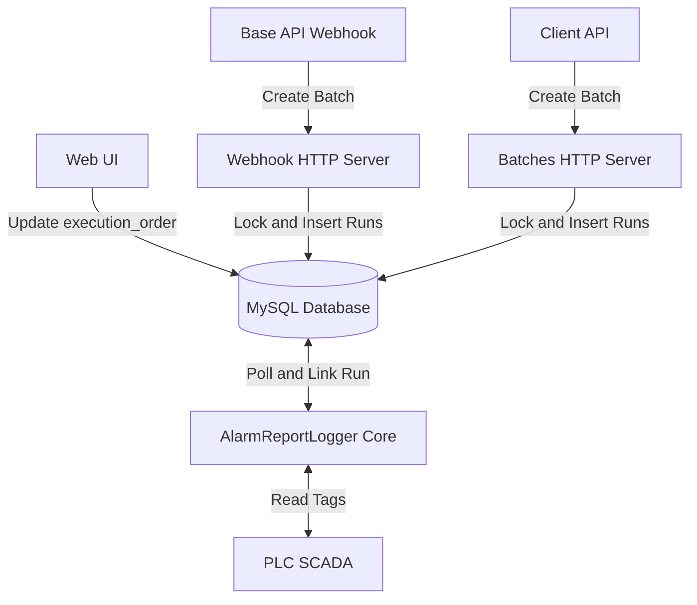
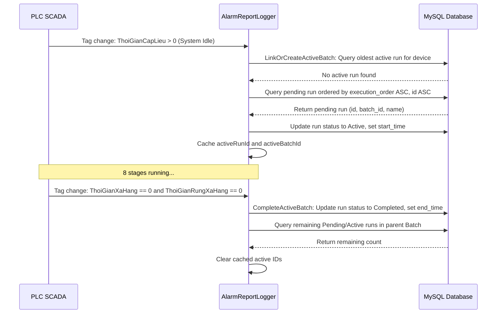
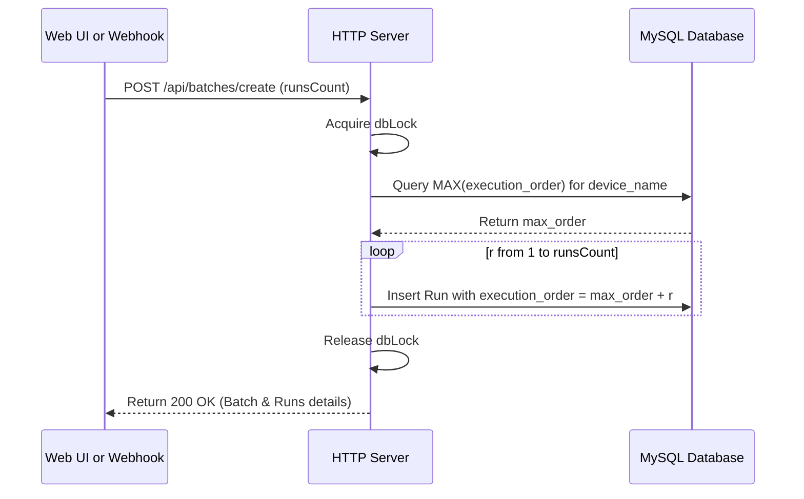

# Technical Design Document: Run Execution Ordering

---
**Purpose**: Detail the architectural and database design changes to support ordering and selection of batch runs (mẻ sản xuất) dynamically in the HinoTools.Alarm system.
---

## Overview

### Purpose
Tính năng này cho phép người vận hành thay đổi thứ tự thực hiện các mẻ sản xuất (runs) đang ở trạng thái chờ (`Pending`) thông qua giao diện Web UI. Ở phía hệ thống Core Server (không có UI), thiết kế này bổ sung trường lưu trữ thứ tự chạy (`execution_order`) trong cơ sở dữ liệu và nâng cấp logic tìm kiếm mẻ chạy tiếp theo từ FIFO truyền thống sang sắp xếp theo thứ tự ưu tiên của trường này. Điều này giúp giải quyết triệt để bài toán chạy xen kẽ các lô hàng khác nhau (ví dụ: đang chạy mẻ 1 của mã hàng AF101 thì tạm dừng để chạy mẻ 1 của mã hàng AF102, sau đó mới quay lại chạy mẻ 2 của AF101).

### Users
* **Nhà vận hành nhà máy (Factory Operators)**: Thực hiện thay đổi thứ tự các mẻ sản xuất đang chờ chạy trên giao diện Web UI tùy thuộc vào tình hình thực tế tại phân xưởng.
* **Hệ thống Core Monitor**: Tự động nhận diện mẻ được ưu tiên chạy tiếp theo dựa trên cấu hình thứ tự trong database để liên kết dữ liệu SCADA/PLC chính xác.

### Impact
Thay đổi cấu trúc bảng `runs` của cơ sở dữ liệu MySQL thông qua cơ chế tự động nâng cấp cấu trúc (migration). Thay đổi câu lệnh SQL định tuyến mẻ hiện hành trong Service chạy ngầm `AlarmReportLogger` và cơ chế sinh mẻ trong các HTTP endpoint của `BatchesHttpServer` và `WebhookHttpServer`.

### Goals
* Hỗ trợ lưu trữ thứ tự chạy độc lập của từng mẻ con (`runs`) thuộc một lô (`batches`).
* Tự động gán số thứ tự chạy tăng dần liên tiếp cho các mẻ con mới tạo của cùng một thiết bị.
* Nâng cấp câu lệnh truy vấn của Core Monitor để luôn chọn mẻ có thứ tự chạy nhỏ nhất để xử lý.
* Bảo toàn tính tương thích ngược bằng cách tự động migrate dữ liệu cũ sang cấu trúc mới dựa trên ID hiện có.

### Non-Goals
* Xây dựng giao diện UI hoặc các API thay đổi vị trí thứ tự chạy (đây là trách nhiệm của dự án Web API/Frontend riêng biệt).
* Quản lý trạng thái chạy dở dang giữa mẻ (mỗi mẻ phải được chạy trọn vẹn và đạt trạng thái `Completed` trước khi mẻ tiếp theo được kích hoạt).

---

## Architecture

### Existing Architecture Analysis
Hiện tại, hệ thống HinoTools.Alarm xác định mẻ chạy tiếp theo dựa trên quy tắc FIFO thuần túy:
1. Khi phát hiện tín hiệu khởi động từ PLC SCADA (`ThoiGianCapLieu > 0` và hệ thống đang ở trạng thái Idle).
2. Hệ thống quét bảng `runs` kết hợp bảng `batches` để tìm mẻ `Pending` cũ nhất (sắp xếp tăng dần theo `batches.id` và `runs.run_number`).
3. Quy tắc này cố định và không cho phép can thiệp thay đổi thứ tự từ bên ngoài. Nếu lô hàng A được tạo trước lô hàng B, toàn bộ các mẻ của lô A bắt buộc phải chạy hết trước khi lô B bắt đầu.

### Architecture Pattern & Boundary Map
Hệ thống sử dụng mô hình DB-Driven Priority Queue. Trạng thái của hàng đợi chạy mẻ được kiểm soát hoàn toàn thông qua cơ sở dữ liệu MySQL chung làm ranh giới tích hợp (boundary) giữa Web UI và Core Monitor.



### Technology Stack

| Layer | Choice / Version | Role in Feature | Notes |
|-------|------------------|-----------------|-------|
| Backend / Services | .NET Framework / C# | Chứa logic giám sát PLC và HTTP API Server | Preserved |
| Data / Storage | MySQL 8.x | Lưu trữ thông tin lô, mẻ sản xuất và thứ tự chạy | Schema update: thêm cột `execution_order` |

---

## System Flows

### 1. PLC Start Run Flow
Quy trình Core Monitor truy vấn và kích hoạt mẻ chạy tiếp theo khi PLC bắt đầu chu kỳ sản xuất mới:



### 2. Batch Creation Sequence Flow
Quy trình sinh số thứ tự chạy liên tục cho các mẻ con khi tạo lô sản xuất mới:



---

## Requirements Traceability

| Requirement | Summary | Components | Interfaces | Flows |
|-------------|---------|------------|------------|-------|
| 1.1 | Tự động migration thêm cột `execution_order` | Database Migration | `EnsureBatchesTableExists` | Khởi động hệ thống |
| 1.2 | Migration dữ liệu lịch sử cho các mẻ cũ | Database Migration | `EnsureBatchesTableExists` | Khởi động hệ thống |
| 2.1 | Sắp xếp mẻ chạy tiếp theo theo `execution_order` | Core Monitor | `LinkOrCreateActiveBatch` | PLC Start Run Flow |
| 2.2 | Sinh lô/mẻ khẩn cấp tự phục hồi nếu không có mẻ chờ | Core Monitor | `LinkOrCreateActiveBatch` | PLC Start Run Flow |
| 3.1 | Truy vấn Max `execution_order` theo thiết bị | HTTP Server | `POST /api/batches/create`, `ProcessWebhookAsync` | Batch Creation Flow |
| 3.2 | Gán số thứ tự chạy tăng dần liên tiếp cho mẻ mới | HTTP Server | `POST /api/batches/create`, `ProcessWebhookAsync` | Batch Creation Flow |
| 3.3 | Trả về trường `execution_order` qua API GET | HTTP Server | `GET /api/runs` | API Client Query |

---

## Components and Interfaces

### 1. Database Migration Module
* **Intent**: Quản lý việc cập nhật tự động cấu trúc cơ sở dữ liệu khi hệ thống khởi động.
* **Requirements**: 1.1, 1.2

#### Responsibilities & Constraints
* Đảm bảo cột `execution_order` được thêm thành công vào bảng `runs` ở mọi máy chủ cài đặt Core mà không cần can thiệp thủ công.
* Thực hiện cập nhật dữ liệu lịch sử một lần duy nhất để tránh xung đột dữ liệu.

#### Contracts (SQL Scripts)
* **Kiểm tra và thêm cột**:
  ```sql
  SHOW COLUMNS FROM `runs` LIKE 'execution_order';
  -- Nếu không tồn tại:
  ALTER TABLE `runs` ADD COLUMN `execution_order` INT NOT NULL DEFAULT 0 AFTER `status`;
  ```
* **Cập nhật dữ liệu cũ**:
  ```sql
  UPDATE `runs` SET `execution_order` = `id` WHERE `execution_order` = 0;
  ```

---

### 2. Core Monitor (AlarmReportLogger)
* **Intent**: Giám sát và ghi nhận trạng thái hoạt động thực tế từ PLC, liên kết mẻ sản xuất phù hợp.
* **Requirements**: 2.1, 2.2

#### Responsibilities & Constraints
* Xác định chính xác mẻ nào sẽ được gán làm mẻ chạy hiện hành dựa trên mức độ ưu tiên của trường `execution_order`.
* Đảm bảo tính tự phục hồi bằng cách tạo mẻ khẩn cấp (fallback) nếu PLC chạy thực tế nhưng hệ thống chưa khai báo mẻ chờ sẵn.

#### Interfaces (C# Methods in AlarmReportLogger.cs)
* **Logic truy vấn mẻ tiếp theo**:
  ```csharp
  // Query gán mẻ Pending tiếp theo được sửa đổi:
  string findQuery = "SELECT r.id, r.batch_id, b.name as batch_name, b.status as batch_status FROM `runs` r " +
                     "JOIN `batches` b ON r.batch_id = b.id " +
                     $"WHERE b.device_name = '{deviceName}' AND r.status = 'Pending' " +
                     "ORDER BY r.execution_order ASC, r.id ASC LIMIT 1";
  ```
* **Logic tạo mẻ khẩn cấp**:
  Khi tạo mẻ khẩn cấp, gán `execution_order` mặc định bằng `0` (hoặc truy vấn Max hiện tại của thiết bị rồi cộng thêm 1 để tránh xung đột thứ tự chạy tiếp theo).

---

### 3. HTTP Server API (BatchesHttpServer & WebhookHttpServer)
* **Intent**: Cung cấp các endpoint HTTP API để quản lý, tạo lập và truy vấn thông tin lô mẻ.
* **Requirements**: 3.1, 3.2, 3.3

#### Responsibilities & Constraints
* Đồng bộ hóa cơ chế tạo mẻ con giữa luồng API trực tiếp và luồng xử lý Webhook bất đồng bộ.
* Sử dụng `lock (dbLock)` để chống tranh chấp dữ liệu khi truy vấn giá trị Max và thực hiện chèn mẻ mới.

#### Contracts (API Endpoints)

##### API Tạo Batch trực tiếp: `POST /api/batches/create`
* **Logic xử lý**:
  1. Đọc tên thiết bị `deviceName`.
  2. Thực hiện câu lệnh SQL tìm giá trị thứ tự lớn nhất hiện hành:
     ```sql
     SELECT IFNULL(MAX(r.execution_order), 0) FROM `runs` r 
     JOIN `batches` b ON r.batch_id = b.id 
     WHERE b.device_name = @device_name;
     ```
  3. Duyệt từ `r = 1` đến `runsCount`, gán `execution_order = maxOrder + r` cho từng mẻ chèn vào DB.
* **Response Body (JSON)**: Trả về chi tiết các run được tạo kèm trường `execution_order`:
  ```json
  {
    "success": true,
    "message": "1 batch(es) created successfully with 2 run(s) each",
    "data": [
      {
        "id": 12,
        "name": "TX01-20260612-01",
        "device_name": "TX01",
        "status": "Pending",
        "total_runs": 2,
        "runs": [
          {
            "id": 24,
            "run_number": 1,
            "name": "TX01-20260612-01-Run01",
            "status": "Pending",
            "execution_order": 15
          },
          {
            "id": 25,
            "run_number": 2,
            "name": "TX01-20260612-01-Run02",
            "status": "Pending",
            "execution_order": 16
          }
        ]
      }
    ]
  }
  ```

##### API Webhook xử lý bất đồng bộ: `POST /api/webhook`
* **Thay đổi chữ ký phương thức**:
  ```csharp
  // Thêm tham số deviceName để truyền từ luồng chính vào background task
  private void ProcessWebhookAsync(int logId, int batchId, string batchName, int totalRuns, string deviceName, System.Collections.Generic.Dictionary<string, string> paramsDict)
  ```
* **Logic xử lý**:
  Tương tự như API trực tiếp, trong vòng lặp tạo mẻ của webhook, thực hiện truy vấn `MAX(execution_order)` của thiết bị `deviceName` trong DB và gán `execution_order` tương ứng cho từng mẻ con mới được chèn.

##### API Lấy danh sách Mẻ của Lô: `GET /api/runs?batch_id=xxx`
* **Response Body (JSON)**: Bổ sung thêm trường `execution_order` vào JSON trả về để Web UI hiển thị và tương tác:
  ```json
  {
    "success": true,
    "data": [
      {
        "id": 24,
        "batch_id": 12,
        "run_number": 1,
        "name": "TX01-20260612-01-Run01",
        "status": "Pending",
        "execution_order": 15,
        "start_time": null,
        "end_time": null,
        "created_at": "2026-06-12 10:00:00"
      }
    ]
  }
  ```

---

## Data Models

### Physical Data Model (MySQL)
Bảng `runs` được bổ sung thêm cột `execution_order`:

```sql
ALTER TABLE `runs` ADD COLUMN `execution_order` INT NOT NULL DEFAULT 0 AFTER `status`;
CREATE INDEX `idx_runs_execution_order` ON `runs` (`execution_order`);
```
* **Giải thích**: Tạo Index trên cột `execution_order` để tối ưu hóa hiệu năng câu lệnh SELECT mẻ chờ chạy của `AlarmReportLogger` (tránh full table scan).

---

## Error Handling

### Error Strategy
* **Lỗi truy vấn Max tự động phục hồi**: Nếu quá trình truy vấn `MAX(execution_order)` xảy ra lỗi (ví dụ: mất kết nối DB tạm thời), gán giá trị mặc định là `0` hoặc sử dụng cơ chế retry truy vấn.
* **Lỗi trùng lặp thứ tự chạy**: Nếu do lỗi logic từ phía Web UI dẫn đến có hai mẻ ở trạng thái `Pending` cùng có chung số thứ tự chạy `execution_order` trên cùng thiết bị, hệ thống Core sẽ giải quyết bằng cách ưu tiên mẻ có `id` nhỏ hơn (tức được tạo trước). Điều này được hiện thực hóa qua mệnh đề: `ORDER BY r.execution_order ASC, r.id ASC`.

---

## Testing Strategy

### Unit Tests
* **TestMigrateOldRuns**: Kiểm thử logic tự động thêm cột và cập nhật giá trị `execution_order = id` cho các bản ghi cũ.
* **TestNextRunSelectionPriority**: Tạo sẵn các mẻ Pending với các mức `execution_order` ngẫu nhiên và kiểm thử xem hàm truy vấn có trả về chính xác mẻ có `execution_order` thấp nhất hay không.
* **TestNextRunFallback**: Đảm bảo hệ thống vẫn tự động sinh mẻ khẩn cấp khi bảng `runs` không có bản ghi Pending nào.

### Integration Tests
* **TestBatchCreationOrderAssigning**: Gọi API `/api/batches/create` (với `runsCount = 2`) và kiểm tra xem các mẻ con được tạo trong DB có đúng số thứ tự chạy tiếp nối mẻ lớn nhất trước đó của thiết bị hay không.
* **TestWebhookAsyncOrderAssigning**: Gửi payload webhook tới `/api/webhook` chứa thông tin BOM cho 2 mẻ, chờ tiến trình background hoàn thành và kiểm tra tính liên tục của `execution_order` trong DB.
