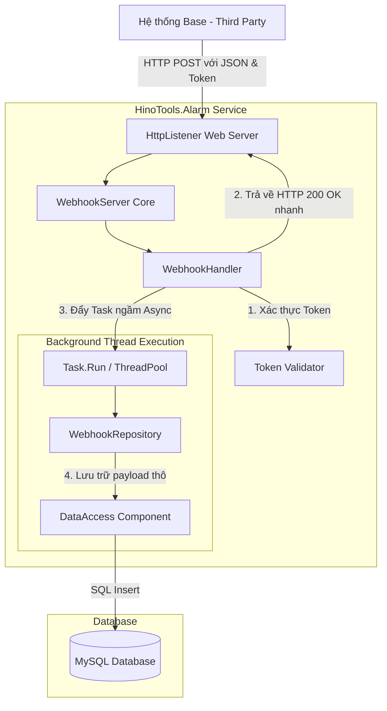
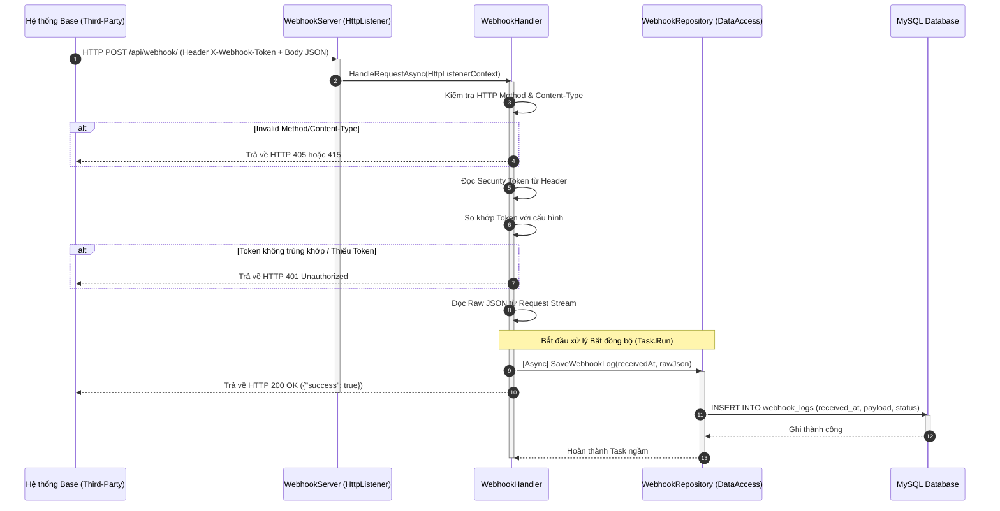

# Technical Design Document - Webhook Receiver

---
**Purpose**: Tài liệu thiết kế kỹ thuật này định nghĩa chi tiết cách thức xây dựng (HOW) hệ thống nhận Webhook (Webhook Receiver) trên nền tảng .NET Framework 4.5 và cơ sở dữ liệu MySQL, ánh xạ trực tiếp từ các yêu cầu nghiệp vụ (WHAT) tại tài liệu Requirements.
---

## 1. Overview

Tính năng **Webhook Receiver** cung cấp một cơ chế nhẹ nhàng và an toàn để hệ thống `HinoTools.Alarm` tiếp nhận các thông báo sự kiện (ví dụ: bắt đầu mẻ) từ một hệ thống Base bên thứ ba. Hệ thống Base sẽ cấu hình URL webhook trỏ tới dịch vụ của chúng ta. Khi sự kiện xảy ra, hệ thống Base gửi một request HTTP POST chứa dữ liệu JSON thô, hệ thống của chúng ta sẽ kiểm tra tính hợp lệ và lưu trữ bất đồng bộ dữ liệu này vào MySQL để xử lý sau.

**Users**: 
- **Hệ thống Base (Bên thứ ba)**: Thực hiện gọi Webhook để đồng bộ hóa thông tin sự kiện.
- **Quản trị viên / Nhà phát triển hệ thống**: Cấu hình cổng, chuỗi mã thông báo bảo mật (security token) và giám sát trạng thái dữ liệu nhận được trong database.

**Impact**: 
Tính năng này bổ sung một cổng lắng nghe HTTP (HTTP Server) chạy ẩn dưới dạng một background thread song song trong solution `HinoTools.Alarm` (thường tích hợp vào Server hoặc Host Service), hoàn toàn độc lập và không ảnh hưởng đến các luồng xử lý WCF hiện có.

### Goals
- **G1**: Thiết lập thành công một HTTP Endpoint tự host cực nhẹ thông qua `System.Net.HttpListener` mà không cần cài đặt IIS hay bổ sung thêm thư viện cồng kềnh.
- **G2**: Đảm bảo bảo mật tối thiểu nhưng hiệu quả bằng cách kiểm tra token qua Header `X-Webhook-Token`.
- **G3**: Lưu trữ thành công toàn bộ payload JSON thô bất đồng bộ vào cơ sở dữ liệu MySQL để tránh chặn luồng HTTP gây ra lỗi timeout cho hệ thống Base.
- **G4**: Dễ dàng cấu hình các tham số vận hành (IP, Port, Security Token) thông qua file cấu hình `App.config`.

### Non-Goals
- **NG1**: Phân tích cú pháp chi tiết nội dung JSON payload sang các lớp C# nghiệp vụ phức tạp ở giai đoạn này (chỉ lưu trữ chuỗi JSON thô).
- **NG2**: Xây dựng UI quản lý danh sách log webhook nhận được (dữ liệu được xem trực tiếp trong database MySQL).
- **NG3**: Triển khai cơ chế SSL/HTTPS trực tiếp trong mã nguồn C# (phần này nên được xử lý ở mức hạ tầng/Reverse Proxy như Nginx hoặc IIS nếu cần bảo mật đường truyền).

---

## 2. Architecture

### Architecture Pattern & Boundary Map
Tính năng Webhook Receiver được xây dựng theo mô hình **Event-driven Receiver & Queue-less Async Persistence** (Bộ nhận sự kiện & lưu trữ bất đồng bộ không qua hàng đợi).



### Architecture Integration
- **Selected Pattern**: Custom HttpListener Server kết hợp Task-based Asynchronous Pattern (TAP). Đây là phương án gọn nhẹ nhất cho ứng dụng tự host (Self-Hosted Console/WinForms) trên .NET Framework 4.5.
- **Domain Boundaries**: Trách nhiệm nhận HTTP request được tách biệt hoàn toàn khỏi trách nhiệm ghi dữ liệu DB. `WebhookHandler` đóng vai trò điều phối, xác thực token và đóng gói payload, sau đó bàn giao công việc I/O nặng nề cho luồng nền.
- **Existing Patterns Preserved**: Việc ghi cơ sở dữ liệu MySQL bảo lưu việc sử dụng component `HinoTools.Alarm.Database.DataAccess` đã có sẵn thông qua các câu lệnh SQL an toàn (Parameterized Query).
- **Steering Compliance**: Đảm bảo hiệu năng hệ thống không bị suy giảm, cô lập hoàn toàn tài nguyên của Webhook API để không gây ảnh hưởng đến dịch vụ WCF lõi của Alarm Service.

### Technology Stack

| Layer | Choice / Version | Role in Feature | Notes |
|-------|------------------|-----------------|-------|
| **Backend / Services** | .NET Framework v4.5 | Lớp chạy logic lõi của Web Server (`HttpListener`) | Tích hợp trực tiếp vào project `HinoTools.Alarm` |
| **Data / Storage** | MySQL v5.7+ / MariaDB | Hệ quản trị cơ sở dữ liệu lưu trữ log webhook | Sử dụng kiểu dữ liệu `LONGTEXT` |
| **Data Access** | MySql.Data v6.8.3.0 | Thư viện kết nối MySQL gốc | Được wrap bởi lớp `DataAccess` của hệ thống |
| **Runtime / OS** | Windows / Windows Service | Môi trường triển khai tự host | Sử dụng HTTP Server API (`http.sys`) của hệ điều hành |

---

## 3. System Flows

Biểu đồ trình tự (Sequence Diagram) mô tả toàn bộ vòng đời của một yêu cầu Webhook gửi từ hệ thống Base đến khi phản hồi và lưu database hoàn tất:



---

## 4. Requirements Traceability

Ánh xạ chi tiết giữa tài liệu yêu cầu (Requirements) và các phần tử thiết kế kỹ thuật:

| Requirement ID | Summary | Components | Interfaces / Classes | Flows |
|-------------|---------|------------|------------|-------|
| **1.1** | Đọc request POST JSON | `WebhookServer`, `WebhookHandler` | `IWebhookHandler` | Bước 1, 2, 8 trong Sequence Flow |
| **1.2** | Kiểm tra HTTP POST | `WebhookHandler` | `IWebhookHandler` | Bước 3 trong Sequence Flow |
| **1.3** | Kiểm tra Content-Type | `WebhookHandler` | `IWebhookHandler` | Bước 3 trong Sequence Flow |
| **1.4** | Trả về HTTP 200 OK thành công | `WebhookHandler` | `IWebhookHandler` | Bước 10 trong Sequence Flow |
| **2.1** | Trích xuất token từ Header | `WebhookHandler` | `IWebhookHandler` | Bước 5 trong Sequence Flow |
| **2.2** | Trả về 401 nếu thiếu token | `WebhookHandler` | `IWebhookHandler` | Bước 6 trong Sequence Flow |
| **2.3** | So khớp token với App.config | `WebhookHandler` | `IWebhookHandler` | Bước 6 trong Sequence Flow |
| **3.1** | Ghi DB bằng component DataAccess | `WebhookRepository` | `IWebhookRepository` | Bước 11 trong Sequence Flow |
| **3.2** | Ghi raw JSON, thời gian, trạng thái 'Pending' | `WebhookRepository` | `IWebhookRepository` | Bước 11 trong Sequence Flow |
| **3.3** | Cấu trúc bảng `webhook_logs` | MySQL Database | Bảng `webhook_logs` schema | Bước 11 trong Sequence Flow |
| **3.4** | Xử lý lỗi kết nối DB và ghi log | `WebhookRepository` | `IWebhookRepository` | Luồng xử lý Exception (catch block) |
| **4.1** | Đẩy tác vụ ghi DB ngầm và phản hồi ngay | `WebhookHandler` | `IWebhookHandler` | Bước 7, 9, 10 trong Sequence Flow |
| **4.2** | Đảm bảo luồng lắng nghe không bị block | `WebhookServer`, `WebhookHandler` | `WebhookServer` Loop, TPL `Task.Run` | Toàn bộ tiến trình xử lý bất đồng bộ |

---

## 5. Components and Interfaces

### Webhook Component Summary

| Component | Domain / Layer | Intent | Req Coverage | Key Dependencies | Contracts |
|-----------|--------------|--------|--------------|------------------|-----------|
| **WebhookServer** | Network / Host | Quản lý vòng đời chạy/dừng của HTTP Listener | 1.1, 4.2 | `HttpListener` (P0), `WebhookHandler` (P0) | Lifecycle Core |
| **WebhookHandler** | Webhook Business | Xác thực bảo mật, xử lý định dạng HTTP và phân luồng bất đồng bộ | 1.1 - 2.3, 4.1 | `IWebhookRepository` (P0) | HTTP Controller-like |
| **WebhookRepository** | Data Access | Thực thi câu lệnh tương tác cơ sở dữ liệu MySQL lưu dữ liệu thô | 3.1 - 3.4 | `DataAccess` (P0) | Persistence Core |

---

### Component Detailed Spec

#### 1. WebhookServer
* **Intent**: Thiết lập luồng chạy ngầm để liên tục lắng nghe các kết nối HTTP TCP đến cổng chỉ định và bàn giao xử lý request cho `WebhookHandler`.
* **Requirements**: 1.1, 4.2
* **Responsibilities & Constraints**:
  - Khởi động lắng nghe cổng khi Host chính khởi chạy.
  - Giải phóng cổng an toàn khi ứng dụng dừng (Stop).
  - Không chặn đứng (non-blocking) luồng UI của ứng dụng chính.
* **Dependencies**:
  - Inbound: `AlarmHost` / `Form1` (Khởi tạo dịch vụ) (P0)
  - Outbound: `WebhookHandler` (Bàn giao xử lý HTTP request) (P0)
  - External: `System.Net.HttpListener` (P0)

##### Server Contract (C# Class Skeleton)
```csharp
namespace HinoTools.Alarm.Webhook
{
    public interface IWebhookServer
    {
        void Start(string host, uint port, string token);
        void Stop();
        bool IsRunning { get; }
    }

    public class WebhookServer : IWebhookServer
    {
        private HttpListener listener;
        private Thread listenerThread;
        private bool isRunning;
        private string securityToken;
        private IWebhookHandler webhookHandler;

        public bool IsRunning => isRunning;

        public void Start(string host, uint port, string token) {
            // Khởi tạo HttpListener
            // Chạy thread nền lắng nghe vòng lặp Accept
        }

        public void Stop() {
            // Dừng Listener, Abort Thread nền an toàn
        }

        private void ListenLoop() {
            // While (isRunning) { var context = listener.GetContext(); Task.Run(() => Handle(context)); }
        }
    }
}
```

---

#### 2. WebhookHandler
* **Intent**: Phân tích yêu cầu HTTP, kiểm tra phương thức POST, xác thực token qua header và đẩy dữ liệu thô vào database bất đồng bộ.
* **Requirements**: 1.1, 1.2, 1.3, 1.4, 2.1, 2.2, 2.3, 4.1
* **Responsibilities & Constraints**:
  - Xác thực header `X-Webhook-Token` với Token lưu trong cấu hình hệ thống.
  - Reject nhanh các request sai cấu hình để bảo vệ tài nguyên hệ thống.
  - Phản hồi mã HTTP 200 OK ngay lập tức cho client sau khi xác thực hợp lệ.
* **Dependencies**:
  - Inbound: `WebhookServer` (P0)
  - Outbound: `WebhookRepository` (Lưu trữ DB) (P0)

##### Handler Contract (C# Class Skeleton)
```csharp
using System.Net;

namespace HinoTools.Alarm.Webhook
{
    public interface IWebhookHandler
    {
        void HandleRequest(HttpListenerContext context, string configuredToken);
    }

    public class WebhookHandler : IWebhookHandler
    {
        private readonly IWebhookRepository repository;

        public WebhookHandler(IWebhookRepository repository)
        {
            this.repository = repository;
        }

        public void HandleRequest(HttpListenerContext context, string configuredToken)
        {
            // 1. Kiểm tra POST method và Content-Type: application/json
            // 2. Kiểm tra Header X-Webhook-Token
            // 3. Đọc dữ liệu JSON từ InputStream
            // 4. Gọi repository.SaveLogAsync(...) không chặn (Fire and forget hoặc Task.Run)
            // 5. Viết response trả về HTTP 200 OK
        }
    }
}
```

##### API Specification (HTTP Contract)

| HTTP Method | Endpoint | Expected Request Header | Request Body | Response Body | HTTP Status Codes |
|--------|----------|---------|----------|----------|-------------------|
| **POST** | `/api/webhook/` | `X-Webhook-Token: <SECRET_TOKEN>`<br>`Content-Type: application/json` | Bất kỳ dữ liệu JSON hợp lệ nào của bên thứ ba | `{"success": true, "message": "Webhook payload received"}` | `200 OK` (Thành công)<br>`401 Unauthorized` (Token sai/thiếu)<br>`405 Method Not Allowed` (Không phải POST)<br>`415 Unsupported Media Type` (Sai Content-Type)<br>`500 Internal Server Error` (Lỗi hệ thống) |

---

#### 3. WebhookRepository
* **Intent**: Thực thi ghi log webhook nhận được vào cơ sở dữ liệu MySQL bằng component `DataAccess` sẵn có.
* **Requirements**: 3.1, 3.2, 3.4
* **Responsibilities & Constraints**:
  - Ghi log bất đồng bộ bằng `Task` để tránh block luồng.
  - Quản lý tài nguyên kết nối an toàn, giải phóng Connection và Command sau khi thực thi SQL.
  - Log lỗi ra file hệ thống nếu xảy ra Exception trong lúc ghi DB.
* **Dependencies**:
  - Inbound: `WebhookHandler` (P0)
  - Outbound: `HinoTools.Alarm.Database.DataAccess` (P0)

##### Repository Contract (C# Class Skeleton)
```csharp
using System.Threading.Tasks;

namespace HinoTools.Alarm.Webhook
{
    public interface IWebhookRepository
    {
        Task SaveLogAsync(string payloadJson);
    }

    public class WebhookRepository : IWebhookRepository
    {
        private readonly Database.DataAccess dataAccess;

        public WebhookRepository(Database.DataAccess dataAccess)
        {
            this.dataAccess = dataAccess;
        }

        public Task SaveLogAsync(string payloadJson)
        {
            // Trả về một Task thực thi câu lệnh SQL INSERT thông qua DataAccess
            // INSERT INTO webhook_logs (received_at, payload, status) VALUES (NOW(), @payload, 'Pending')
        }
    }
}
```

---

## 6. Data Models

### Physical Data Model (MySQL Bảng `webhook_logs`)

Để lưu trữ toàn bộ thông tin webhook thô nhận được từ bên thứ 3 phục vụ việc phân tích bất đồng bộ, chúng ta thiết kế một bảng mới tên là `webhook_logs` trong cơ sở dữ liệu MySQL hiện tại của hệ thống.

```sql
CREATE TABLE IF NOT EXISTS `webhook_logs` (
    `id` INT AUTO_INCREMENT PRIMARY KEY COMMENT 'Khóa chính, tự động tăng',
    `received_at` DATETIME NOT NULL COMMENT 'Thời gian hệ thống nhận được Webhook (Local Time)',
    `payload` LONGTEXT NOT NULL COMMENT 'Dữ liệu JSON thô nhận được từ hệ thống Base',
    `status` VARCHAR(50) NOT NULL DEFAULT 'Pending' COMMENT 'Trạng thái xử lý: Pending, Processed, Failed',
    `error_message` LONGTEXT NULL COMMENT 'Thông tin lỗi hệ thống nếu quá trình ghi nhận gặp sự cố'
) ENGINE=InnoDB DEFAULT CHARSET=utf8mb4 COLLATE=utf8mb4_unicode_ci COMMENT='Bảng lưu trữ log nhận từ các webhook bên thứ 3';
```

**Indexes & Performance Optimization**:
- Tạo index trên cột `status` để hỗ trợ các câu lệnh truy vấn quét mẻ sau này nhanh hơn:
  ```sql
  CREATE INDEX `idx_webhook_logs_status` ON `webhook_logs` (`status`);
  ```
- Sử dụng kiểu dữ liệu `LONGTEXT` thay vì `VARCHAR` thông thường để bảo đảm dung lượng lưu trữ lên tới 4GB văn bản JSON, phòng ngừa hệ thống Base đẩy gói tin chứa dữ liệu lớn của hàng loạt mẻ.

---

## 7. Error Handling

### Error Strategy
Hệ thống tuân thủ nguyên tắc **Fail-Fast** đối với tầng HTTP Request (trả lỗi ngay cho client nếu request sai cấu hình) và **Graceful Degradation** đối với tầng lưu trữ (ghi log lỗi cục bộ ra file nếu database MySQL tạm thời mất kết nối để không làm sập ứng dụng chính).

### Error Categories and Responses

1. **User HTTP Errors (4xx - Client/Hệ thống Base gửi sai)**:
   - **405 Method Not Allowed**: Xảy ra khi hệ thống Base gửi request GET, PUT hoặc DELETE tới webhook URL. Hệ thống trả ngay lỗi 405 kèm message `{"success": false, "message": "Only HTTP POST is allowed"}`.
   - **415 Unsupported Media Type**: Xảy ra khi Content-Type không phải là `application/json`. Phản hồi lỗi 415 kèm message `{"success": false, "message": "Content-Type must be application/json"}`.
   - **401 Unauthorized**: Xảy ra khi thiếu header `X-Webhook-Token` hoặc giá trị token không khớp cấu hình. Trả lỗi 401 và ghi nhận địa chỉ IP của Client gửi yêu cầu để phát hiện tấn công brute-force.

2. **System Errors (5xx - Lỗi phía cơ sở dữ liệu hoặc máy chủ)**:
   - **Database Connection Timeout / Down**: Xảy ra khi MySQL bị mất kết nối hoặc quá tải. 
     - *Phục hồi*: Khối lệnh ghi DB được bảo vệ bằng `try-catch`. Nếu xảy ra lỗi ghi DB, chương trình sẽ ghi thông tin stack trace chi tiết vào file nhật ký `alarm_debug.log` thông qua cơ chế ghi log sẵn có của hệ thống.
     - *Phản hồi*: Nếu lỗi xảy ra trước khi phản hồi HTTP được gửi đi, trả về `500 Internal Server Error` cho hệ thống base. Nếu xảy ra trong Task chạy ngầm (sau khi đã phản hồi `200 OK`), hệ thống sẽ tiếp tục duy trì hoạt động và ghi log lỗi ra file hệ thống.

---

## 8. Testing Strategy

Do tính chất tự host và giao tiếp HTTP, chiến lược kiểm thử tập trung vào việc tạo các Mock Request và kiểm tra phản hồi đúng trạng thái mã HTTP cùng tính đúng đắn của dữ liệu lưu trong DB.

### Unit & Integration Tests

1. **Kiểm thử Xác thực (Authentication Hook Tests)**:
   - **Test 1**: Gửi POST request với token chính xác -> Kỳ vọng: Trả về HTTP `200 OK`, bản ghi được tạo trong MySQL với trạng thái `Pending`.
   - **Test 2**: Gửi POST request thiếu header `X-Webhook-Token` -> Kỳ vọng: Trả về HTTP `401 Unauthorized`, không có bản ghi nào được ghi vào DB.
   - **Test 3**: Gửi POST request với token sai -> Kỳ vọng: Trả về HTTP `401 Unauthorized`.

2. **Kiểm thử Kiểm soát HTTP Protocol (Protocol Validation Tests)**:
   - **Test 4**: Gửi GET request tới API -> Kỳ vọng: Trả về HTTP `405 Method Not Allowed`.
   - **Test 5**: Gửi POST request với Content-Type `text/plain` -> Kỳ vọng: Trả về HTTP `415 Unsupported Media Type`.

3. **Kiểm thử Bất đồng bộ & Hiệu năng (Asynchronous Integration Tests)**:
   - **Test 6 (Concurrency Stress Test)**: Giả lập gửi đồng thời 100 request Webhook POST liên tiếp từ nhiều luồng Client khác nhau. 
     - *Kỳ vọng*: Tất cả 100 request nhận được phản hồi `200 OK` nhanh chóng (trung bình dưới 50ms/request), và cơ sở dữ liệu MySQL cuối cùng ghi nhận chính xác đủ 100 bản ghi dữ liệu thô tương ứng mà không gặp hiện tượng khóa chết (deadlock) connection.

---

## 9. Security & Performance Considerations

### Security
- **Authentication**: Xác thực API Key qua Custom HTTP Header (`X-Webhook-Token`) tránh để lộ token trên URL (như query parameters).
- **SSL Offloading**: Do .NET v4.5 tự host `HttpListener` có độ phức tạp cao khi tích hợp chứng chỉ SSL (cần đăng ký cổng thủ công bằng `netsh http add sslcert` trên Windows Server), khuyến nghị giải pháp hạ tầng: **Đặt ứng dụng đằng sau một Reverse Proxy (ví dụ: Nginx)**. Proxy này sẽ chịu trách nhiệm lắng nghe kết nối HTTPS công khai, xác thực chứng chỉ SSL, sau đó chuyển tiếp request HTTP an toàn tới `HttpListener` cục bộ qua mạng nội bộ.

### Performance & Scalability
- **Non-blocking Request Handling**: Sử dụng mô hình xử lý đa luồng bất đồng bộ thông qua `ThreadPool` của `HttpListener.GetContext` giúp server tiếp nhận hàng trăm request đồng thời mà không bị treo.
- **Payload Size Restriction**: Để tránh tấn công DDoS bằng các payload khổng lồ làm tràn bộ nhớ máy chủ, kích thước của luồng đọc InputStream trong `WebhookHandler` sẽ bị giới hạn tối đa ở mức **5MB** cho mỗi request. Mọi request có body lớn hơn sẽ bị ngắt kết nối ngay lập tức.
